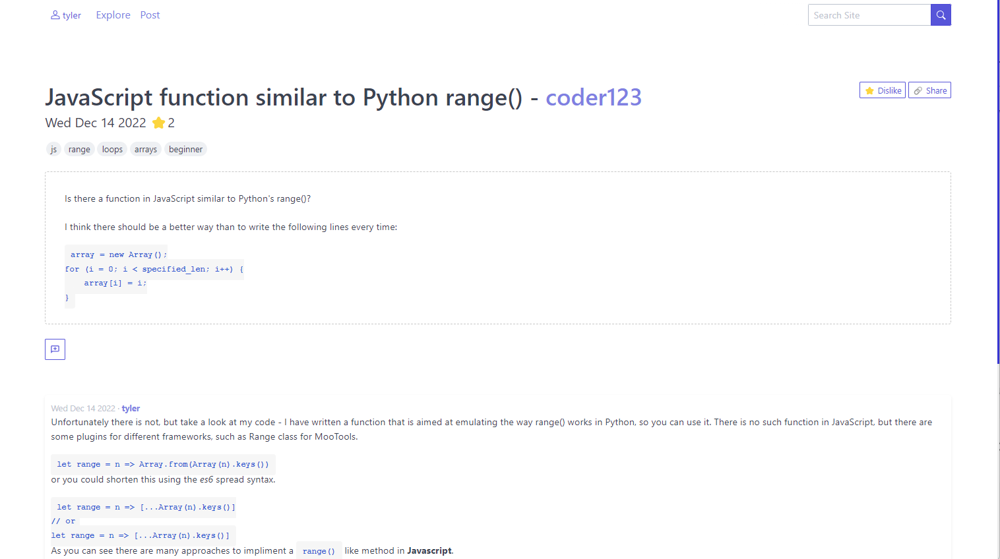

# Developer Forum Application

<!-- [](https://github.com/pages-themes/minimal/actions/workflows/ci.yaml) [](https://badge.fury.io/rb/jekyll-theme-minimal) -->

Dev-forum is a platform for developers to discuss and share code with another in open forums. Users can explore and contribute to forums easily and discuss their coding issues or ideas with the world.

Posts and Comments are expressed through `markdown` format which provides a nice clean way to write structured content easily.



## Usage & Installation

Currently the site has not been published online and can only be viewed through a local environment. However if you would like to contribute or view the site locally you will need to install and configure a few things:

First make sure you have a recent version of [NodeJS](https://nodejs.org/en/) installed on your machine as well as [MongoDB](https://www.mongodb.com/docs/manual/installation/) for our database.

1. Next clone the repository to your machine `tlaceby/dev-forum`:

   ```bash
   git clone https://github.com/tlaceby/dev-forum.git
   cd dev-forum
   ```

2. Either using [npm](https://nodejs.org/en/) or [pnpm](https://pnpm.io/) run the install command. Once all dependecies are collected and installed you can run the application on localhost using the dev command:

   ```bash
   npm install
   npm run dev
   ```

This will startup the server on `http://localhost:5173`.

## Features

_dev-forum_ currently has a limited feature set as it has only been in development for about one month. Here is a list of some of the completed features and app functionality.

1. User authentication & session management. Remember me as well as authentication & validation checks.
2. User profile customication.
   1. Users can update their about section for others to see in realtime.
3. Robust error handling
   1. Toasts & dynamic error handling can be found everywhere throught the app.
   2. No need to get back a error page from the server if something goes wrong. Instead using **Javascript** we can notify the user of errors without making requests to the server.
   3. Svelte enhancement makes errors and provide such a wonderfull user experience with almost zero extra page reloads.
4. Post Tags are indexable with `Date` `Tags[]` `title` `stars` and `author`.
5. Posts can be edited without the need to reload the entire page.
6. [markdown](https://www.markdownguide.org/) support is added to **_posts_** and **_comments_**. This allows users to express their content and have it be rendered to the user using markdown format.
7. Simple user **signup** & **registration**.
8. Preloading of most comment means the second your mouse hovers over a link the page and it's assets are preloaded for your speedy enjoyment.

### Contributing

If you wish to contribute to `dev-forum` then I would love any extra help. After following the guide to installation I suggest you take a look at the **bugs** list as well as **feature** list below.

#### Bugs

- Uasers cannot modify there comments and this is a mage pain in the but.
- Toasts can stack past the page bottom causing a bit of a jitter to the UX when too many are loaded.
- Inside the code blocks in markdown the code blocks are highlighted only until the newline character.

#### Planned Features

- Support for comments to be modfied by its owner.
- Comments to be nested.
- currently going to `/posts/` does not provide you anything useful.
  - Implimenting proper searching by anything other than `stars`.
- Add support for users to like `comments`.
- The owner should be able to `close` and `open` posts for discussion.
- The owner of a post should also be able to `pin` comments and select the best `comment`.
- Adding support for pagination and search tabs.
- Allowing users to delete their accounts.
- User messages/friendships would be cool?
- Badges and tiers. If you have X stars you can get a badge.
- Avatars / profile images.

### License

This project is hosted under an [Apache Licesnse 2.0](https://www.apache.org/licenses/LICENSE-2.0.html). The terms and conditions of this are listed in the [license.md](./license.md).
